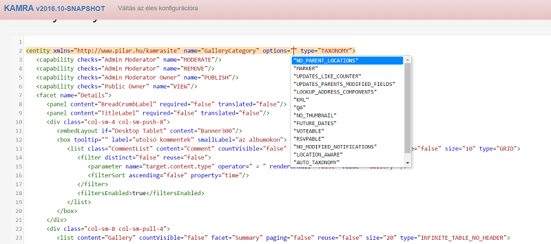

# codemirror-jaxb
This library generates xml hints in javascript format from JAXB annotated classes to be used with CodeMirror's xmlhint system

CodeMirror: http://codemirror.net/

The code in action: 

# Dependency

Add dependency to pom:
~~~~
<dependency>      
 <groupId>hu.pilar</groupId>
 <artifactId>codemirror-jaxb</artifactId>
 <version>0.2</version>
</dependency>
~~~~
Add pilar.hu repository to settings.xml or nexus:
~~~~
 <repository>
   <id>pilar</id>
   <url>http://www.pilar.hu/nexus/content/groups/public</url>
</repository>
~~~~
# Using it

There is a single API entry point in HintGenerator class. It was designed to be used as a singleton, either via Spring or by any other  means. 

## Basic example
~~~~
HintGenerator hg = new HintGenerator(new ObjectMapper()); // pass in a jackson ObjectMapper
XmlHint hint = hg.getHintsFor(AnyJaxbAnnotatedClass.class); // the JAXB root object class
System.out.println(hint.toJson());
~~~~
## Providing custom attribute values 
~~~~
HintGenerator hg = new HintGenerator(new ObjectMapper(),  new IAttributeValueFactory() {
            @Override
            public Set<String> getValuesFor(String attributeName, Class type) {
                if ("yearOfBirth".equals(attributeName)) {
                    return Sets.newHashSet(IntStream.range(1900, LocalDate.now().getYear()).mapToObj(Integer::toString).collect(Collectors.toSet()));
                }
                return null;
            }
        });
~~~~
## Reusing reflections data

This library is using Reflections.org utilities to find all subclasses of a given type. If you're using the same library in your own application, you can eliminate the additional time it takes to gather data from the class loader(s) about all loaded classes by passing in your own Reflections object in the constructor:

~~~~
HintGenerator hg = new HintGenerator(new ObjectMapper(), new ReflectionBasedSubclassFinder(reflections), new IAttributeValueFactory() ... );
~~~~
or 
~~~~
HintGenerator hg = new HintGenerator(new ObjectMapper(), new ReflectionBasedSubclassFinder(reflections));
~~~~
## Usage with Spring

In your @Configuration class add the bean:
~~~~
@Bean
public HintGenerator hintGenerator() {
  return new HintGenerator(...); // use any of the previous examples
}
~~~~

